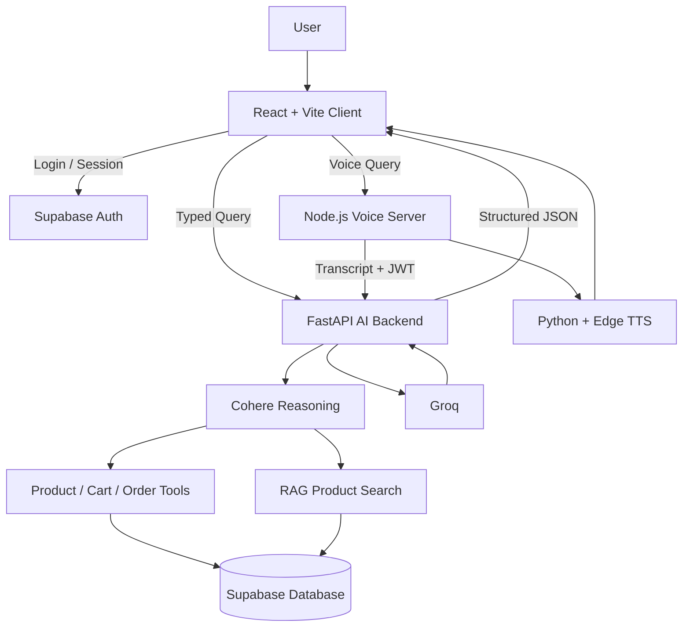

# 🛒 EchOo — Voice Command Grocery Shopping Assistant

<p align="center">
  
</p>

<p align="center">
  <b>AI-powered grocery shopping with voice commands, smart search, recommendations, cart management, and text-to-speech.</b>
</p>

<p align="center">
  <a href="https://echoo-grocery-shopping-assistant.onrender.com">
    
  </a>
  <a href="https://grocery-chatbot-api.onrender.com/health">
    
  </a>
  
  
</p>

---

## 🌐 Live Application

**Frontend + Voice Server:**  
https://echoo-grocery-shopping-assistant.onrender.com

**AI Backend:**  
https://grocery-chatbot-api.onrender.com

---

## 📌 Overview

**EchOo** is a voice-enabled grocery shopping assistant designed for natural, conversational shopping.

Users can search for products, filter by price or size, manage their cart, receive alternatives and recommendations, and interact with the application using either text or voice.

The project combines a React shopping interface, Node.js voice services, Supabase authentication/database, a Python AI backend, Cohere reasoning, Groq response generation, and RAG-powered product discovery.

---

## ✨ Features

### 🎙️ Voice Shopping
- Browser-based microphone input
- Natural voice commands
- Real-time recognized text feedback
- Automatic voice-query submission
- Text-to-speech assistant responses
- Stop Response control

### 🧠 Natural Language Understanding
- Flexible conversational queries
- Context-aware follow-up commands
- Product + variant memory across turns
- Cohere-powered reasoning and tool selection
- Groq-powered natural responses

### 🔎 Product Discovery
- Product search
- Brand filtering
- Price filtering
- Size / SKU variant selection
- Stock information
- Product alternatives
- Smart recommendations
- RAG-based semantic product discovery

### 🛒 Cart Management
- Add products
- Remove products
- Change quantities
- Variant-aware cart actions
- Persistent user-specific cart state

### 📦 Orders
- Order creation
- Order details
- Order history
- Authenticated user isolation

### 🔐 Authentication
- Supabase authentication
- Email/password authentication
- Google OAuth support
- User-specific sessions
- JWT-protected backend requests

### 🎨 UI / UX
- Minimal shopping interface
- Responsive layout
- Loading states
- Voice status feedback
- Product cards
- Variant cards
- Cart and order displays
- Mobile-friendly interaction

---

## 🖼️ Application Preview

> Create a folder named `docs/images/` and add your screenshots using the filenames below. GitHub will display them automatically.

### Home

<p align="center">
  
</p>

### AI Voice Assistant

<p align="center">
  
</p>

### Product Search & Variants

<p align="center">
  
</p>

### Cart

<p align="center">
  
</p>

### Mobile View

<p align="center">
  
</p>

---

## 🏗️ Architecture



---

## 🧰 Technology Stack

| Layer | Technology |
|---|---|
| Frontend | React 19, Vite |
| Styling/UI | CSS, Lucide React, Framer Motion |
| Authentication | Supabase Auth |
| Database | Supabase PostgreSQL |
| Voice Server | Node.js, Express |
| Browser STT | Web Speech Recognition API |
| TTS | Edge TTS + Python |
| AI Backend | Python, FastAPI |
| Reasoning | Cohere |
| Response Generation | Groq |
| Product Retrieval | RAG + Supabase |
| Search Matching | RapidFuzz |
| Deployment | Render |
| Containerization | Docker |

---

## 📂 Project Structure

```text
echoo-grocery-shopping-assistant/
│
├── client/
│   ├── src/
│   │   ├── api/
│   │   ├── context/
│   │   ├── components/
│   │   └── pages/
│   ├── package.json
│   └── ...
│
├── server/
│   ├── src/
│   │   ├── controllers/
│   │   ├── routes/
│   │   └── services/
│   ├── python/
│   │   ├── SpeechToText.py
│   │   └── TextToSpeech.py
│   └── package.json
│
├── auth/
├── core/
├── database/
├── prompts/
├── rag/
├── tools/
│
├── api.py
├── api_context.py
├── api_models.py
├── response_mapper.py
├── config.py
├── requirements.txt
├── Dockerfile
└── README.md
```

---

## ⚙️ Environment Variables

### Client / Vite

Create `client/.env` locally:

```env
VITE_SUPABASE_URL=YOUR_SUPABASE_URL
VITE_SUPABASE_ANON_KEY=YOUR_SUPABASE_ANON_KEY
VITE_ASSISTANT_API_URL=https://grocery-chatbot-api.onrender.com
VITE_VOICE_API_URL=http://localhost:5000
VITE_ASSISTANT_VOICE=en-IN-NeerjaNeural
VITE_INPUT_LANGUAGE=en-IN
```

> `VITE_VOICE_API_URL` is for local development. In production, the React client and Node voice server share the same Render origin.

### Backend Secrets

Configure backend secrets through your deployment environment:

```env
SUPABASE_URL=
SUPABASE_PUBLISHABLE_KEY=
SUPABASE_SECRET_KEY=

COHERE_API_KEY=
COHERE_MODEL=

GROQ_API_KEY=
GROQ_API_KEY1=
GROQ_API_KEY2=
GROQ_MODEL=openai/gpt-oss-120b
```

> Never commit `.env` files, Supabase secret keys, Groq API keys, or Cohere API keys to GitHub.

---

## 🚀 Run Locally

### 1. Clone

```bash
git clone https://github.com/Sp-bit-code/echoo-grocery-shopping-assistant.git
cd echoo-grocery-shopping-assistant
```

### 2. Install Python Dependencies

```bash
python -m pip install -r requirements.txt
```

### 3. Start Node Voice Server

```bash
cd server
npm install
npm start
```

Voice server:

```text
http://localhost:5000
```

### 4. Start React Client

Open another terminal:

```bash
cd client
npm install
npm run dev
```

Frontend:

```text
http://localhost:5173
```

---

## 🎤 Example Commands

```text
Show me milk under ₹100
Find me Maggi
Show the 32g variant
Add it to my cart
Remove milk from my cart
Show my orders
Suggest a healthy snack
```

---

## 🔌 Voice API Endpoints

```text
POST /api/voice/speech-to-text
POST /api/voice/chat
POST /api/voice/text-to-speech
GET  /health
```

---

## 🔒 Security

- Authentication is handled through Supabase.
- Backend user identity is derived from the verified Supabase access token.
- Frontend-provided user IDs are not trusted for protected operations.
- Sensitive API keys remain server-side.
- `.env` files are excluded from Git.
- User-specific data is designed to work with Supabase Row Level Security.

---

## 🧪 Example Context-Aware Interaction

```text
User: Show me Maggi

EchOo:
Here are the available Maggi products and variants.

User: 32g

EchOo:
The 32g variant is available.

User: Add it to cart

EchOo:
The selected 32g Maggi variant has been added to your cart.
```

---

## 📝 Technical Assessment Approach

EchOo was built as a modular voice-first grocery shopping assistant. The React/Vite client handles shopping, authentication, microphone interaction, visual feedback, and structured assistant results. Supabase provides authentication and persistent product, cart, user, and order data. Voice input is captured in the browser using the Web Speech Recognition API, while a Node.js service handles voice API orchestration and Python Edge TTS output. The FastAPI AI backend validates authenticated users and processes shopping requests. Cohere is used for reasoning and deciding when product, cart, order, or RAG tools are required. Supabase remains the source of truth for live commerce data such as prices, variants, stock, carts, and orders. Groq generates natural-language responses from verified backend results. RAG supports semantic product discovery and recommendations. The application is containerized with Docker and deployed on Render, with the React production build and Node voice server sharing one public service.

---

## ✅ Assessment Requirements Covered

- ✅ Voice command recognition
- ✅ Flexible natural-language commands
- ✅ Product search by price / brand / size
- ✅ Cart add / remove / quantity operations
- ✅ Product categorization
- ✅ Product alternatives
- ✅ Smart recommendations
- ✅ Visual feedback
- ✅ Loading states
- ✅ Responsive UI
- ✅ Voice response / TTS
- ✅ Authentication
- ✅ Persistent cart and orders
- ✅ Production deployment
- ✅ Error handling
- ✅ Modular architecture

---

## 🔮 Future Enhancements

- Expanded multilingual voice recognition
- Seasonal recommendation engine
- Shopping-history-based replenishment reminders
- Sale and discount recommendation rules
- Streaming assistant responses
- Additional voice languages
- More advanced personalization

---

## Project

**EchOo — Voice Command Grocery Shopping Assistant**

Built as a Software Engineering Technical Assessment project.
