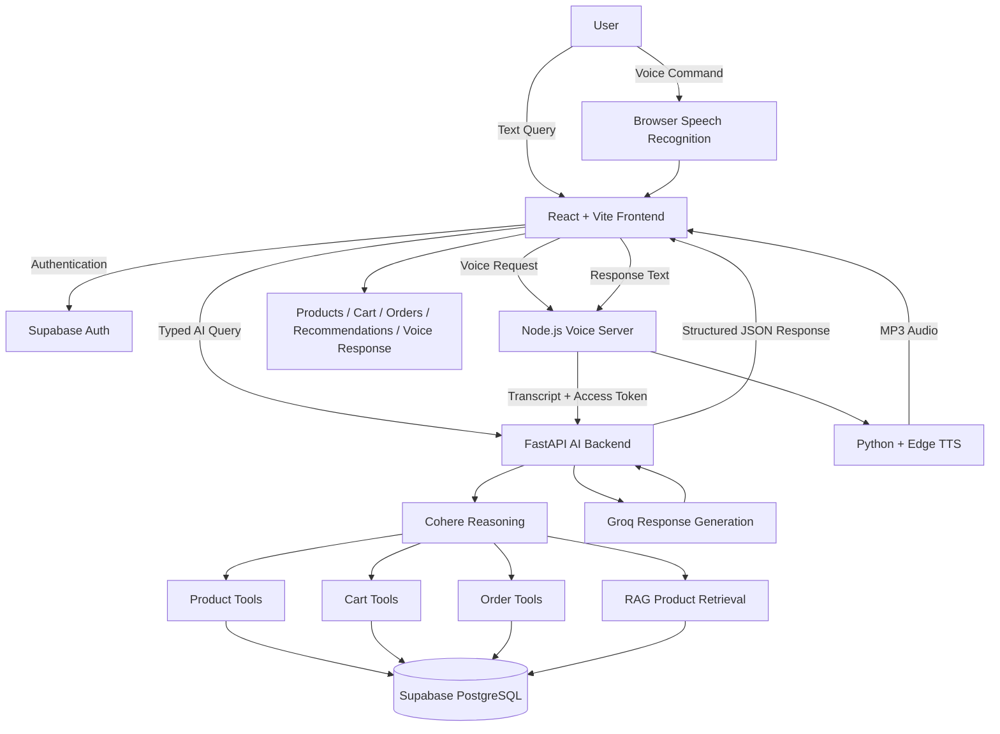

# EchOo — Voice Command Grocery Shopping Assistant

## 1. Approach

EchOo is a voice-enabled grocery shopping application built to provide a natural and conversational shopping experience. The frontend uses React and Vite, while Supabase manages authentication and persistent product, user, cart, and order data.

Users can interact through text or browser-based voice commands. Voice input is captured using the Web Speech Recognition API and processed through a Node.js voice service. The FastAPI AI backend uses Cohere for reasoning and tool selection across product search, cart operations, orders, and RAG-based retrieval. Supabase remains the source of truth for live product data such as variants, prices, stock, carts, and orders. Groq generates natural-language responses using verified backend results.

The system supports contextual follow-up commands, product filtering, cart management, alternatives, recommendations, visual feedback, loading states, and text-to-speech responses.

The application is containerized with Docker and deployed on Render.

### Project Links

| Resource | Link |
|---|---|
| 🌐 Live Website | [https://echoo-grocery-shopping-assistant.onrender.com/](https://echoo-grocery-shopping-assistant.onrender.com/) |
| 💻 Website GitHub | [https://github.com/Sp-bit-code/echoo-grocery-shopping-assistant](https://github.com/Sp-bit-code/echoo-grocery-shopping-assistant) |
| 🤖 Voice Command Chatbot GitHub | [https://github.com/Sp-bit-code/Grocery-Chatbot-API](https://github.com/Sp-bit-code/Grocery-Chatbot-API) |
| 🚀 Live AI Backend | [https://grocery-chatbot-api.onrender.com/](https://grocery-chatbot-api.onrender.com/) |

---

# 2. Project Explanation

EchOo allows users to shop using natural text or voice commands instead of navigating through traditional product filters manually.

For example, a user can say **“Show me milk under ₹100”**, **“Find Maggi”**, **“Show me the 32g variant”**, or **“Add it to my cart.”** The assistant maintains conversation context, allowing short follow-up commands to refer to previously selected products and variants.

Products are retrieved from Supabase and can contain multiple SKU variants with individual size, price, and stock information. RAG enables semantic product discovery, while the assistant can also provide alternatives and relevant recommendations.

Authenticated users have isolated cart, profile, and order data. Voice responses are generated using Edge TTS and returned to the browser as audio.

The application provides visual confirmation of recognized commands, loading states, structured product results, cart actions, order information, and responsive interaction across the shopping experience.

---

# 3. Implemented Features

| Category | Feature | Implementation |
|---|---|---|
| 🎙️ Voice Input | Voice command recognition | Browser microphone using Web Speech Recognition |
| 🎙️ Voice Input | Natural voice queries | Supports conversational shopping commands |
| 🎙️ Voice Input | Real-time transcription | Recognized text is displayed while speaking |
| 🎙️ Voice Input | Automatic submission | Voice query is automatically processed after recognition |
| 🎙️ Voice Input | Configurable language | Input language can be configured through environment settings |
| 🧠 NLP | Natural-language processing | Handles different ways of expressing the same shopping request |
| 🧠 NLP | Context-aware conversation | Maintains selected product and variant context across follow-up queries |
| 🧠 NLP | AI reasoning | Cohere determines whether product, cart, order, or RAG tools are required |
| 🔎 Search | Product search | Search products using text or voice |
| 🔎 Search | Brand filtering | Supports brand-specific product queries |
| 🔎 Search | Price filtering | Supports commands such as “milk under ₹100” |
| 🔎 Search | Size filtering | Supports SKU and product-size selection |
| 🔎 Search | Stock availability | Displays stock information for available variants |
| 🔎 Search | Semantic search | RAG supports meaning-based product discovery |
| 🛒 Cart | Add products | Products can be added through conversational commands |
| 🛒 Cart | Remove products | Cart items can be removed through commands |
| 🛒 Cart | Quantity management | Product quantities can be modified |
| 🛒 Cart | Variant-aware cart | Selected SKU or size is retained during cart operations |
| 🛒 Cart | Persistent cart | Cart data is stored for the authenticated user |
| 🗂️ Products | Product categorization | Products are organized by grocery categories |
| 💡 Suggestions | Product recommendations | Relevant products can be suggested through RAG |
| 💡 Suggestions | Alternatives | Alternative products can be returned when appropriate |
| 📦 Orders | Order creation | Orders can be created and stored |
| 📦 Orders | Order details | Individual order details are maintained |
| 📦 Orders | Order history | Users can view previous orders |
| 🔐 Authentication | Email/password | Supabase authentication |
| 🔐 Authentication | Google OAuth | Google authentication through Supabase |
| 🔐 Authentication | User isolation | Protected operations are linked to the verified authenticated user |
| 👤 Profile | User profile | User information is stored through Supabase |
| 🔊 Voice Output | Text-to-speech | Assistant responses are converted to speech using Edge TTS |
| 🔊 Voice Output | Stop Response | Users can immediately stop assistant speech |
| ⏳ UX | Loading states | Visual processing states are displayed during AI operations |
| 👁️ UX | Visual feedback | Recognized commands, products, variants, actions, cart and orders are displayed |
| 📱 UX | Responsive interface | Interface is designed for desktop and mobile use |
| 🛠️ Admin | Product management | Admin interface supports management of grocery products |
| 🗄️ Database | Supabase PostgreSQL | Stores products, users, carts and orders |
| 🔒 Security | JWT authentication | AI requests use authenticated Supabase access tokens |
| 🔒 Security | RLS-compatible design | User-specific database operations remain isolated |
| 🚀 Deployment | Docker | Application is containerized for production |
| 🚀 Deployment | Render | Website, voice service and AI backend are deployed |

---

# 4. System Architecture



### Request Flow

```text
User
  │
  ├────────────── Text Query
  │
  └────────────── Voice Query
                       │
                       ▼
             Browser Speech Recognition
                       │
                       ▼
                 React + Vite
                       │
              ┌────────┴─────────┐
              │                  │
              ▼                  ▼
       Supabase Auth       Node Voice Server
                                 │
                                 ▼
                         FastAPI AI Backend
                                 │
                                 ▼
                              Cohere
                                 │
              ┌──────────────────┼──────────────────┐
              ▼                  ▼                  ▼
        Product Tools       Cart / Orders          RAG
              │                  │                  │
              └──────────────────┼──────────────────┘
                                 ▼
                              Supabase
                                 │
                                 ▼
                               Groq
                                 │
                                 ▼
                       Structured Response
                                 │
                                 ▼
                            React UI
                          /          \
                         ▼            ▼
                  Visual Output    Voice TTS
```

---

# 5. Interface

## Home Page

<p align="center">
  
</p>

---

## AI Voice Assistant

<p align="center">
  
</p>

---

## Shopping Menu

<p align="center">
  
</p>

---

## Orders

<p align="center">
  
</p>

---

## Admin Interface

<p align="center">
  
</p>

---

# 6. Technology Stack

| Layer | Technology |
|---|---|
| Frontend | React 19 |
| Build Tool | Vite |
| Routing | React Router |
| UI / Icons | Lucide React, Heroicons |
| Animation | Framer Motion |
| Authentication | Supabase Auth |
| Database | Supabase PostgreSQL |
| Backend API | Python + FastAPI |
| Voice Server | Node.js + Express |
| Voice Recognition | Web Speech Recognition API |
| Text-to-Speech | Python + Edge TTS |
| AI Reasoning | Cohere |
| Response Generation | Groq — `openai/gpt-oss-120b` |
| Product Retrieval | RAG |
| Search / Matching | RapidFuzz |
| HTTP Communication | Fetch, HTTPX, Requests |
| Containerization | Docker |
| Deployment | Render |
| Version Control | Git + GitHub |

---

# 7. Environment Configuration

Environment files and private API credentials are not committed to the repository.

## Frontend Environment

```env
VITE_SUPABASE_URL=YOUR_SUPABASE_URL
VITE_SUPABASE_ANON_KEY=YOUR_SUPABASE_ANON_KEY

VITE_ASSISTANT_API_URL=https://grocery-chatbot-api.onrender.com

VITE_VOICE_API_URL=http://localhost:5000

VITE_ASSISTANT_VOICE=en-IN-NeerjaNeural
VITE_INPUT_LANGUAGE=en-IN
```

## AI Backend Environment

```env
SUPABASE_URL=YOUR_SUPABASE_URL
SUPABASE_PUBLISHABLE_KEY=YOUR_SUPABASE_PUBLISHABLE_KEY
SUPABASE_SECRET_KEY=YOUR_SUPABASE_SECRET_KEY

COHERE_API_KEY=YOUR_COHERE_API_KEY
COHERE_MODEL=YOUR_COHERE_MODEL

GROQ_API_KEY=YOUR_GROQ_API_KEY
GROQ_API_KEY1=YOUR_SECOND_GROQ_API_KEY
GROQ_API_KEY2=YOUR_THIRD_GROQ_API_KEY

GROQ_MODEL=openai/gpt-oss-120b
GROQ_TEMPERATURE=0.0

RAG_MATCH_COUNT=5
MAX_CHAT_HISTORY=10
```

> Secret keys are stored securely as deployment environment variables and are never committed to GitHub.

---

<p align="center">
  
</p>
